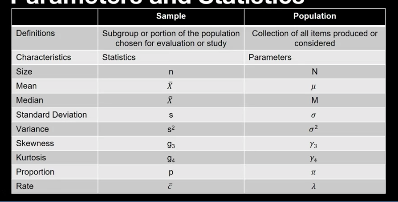
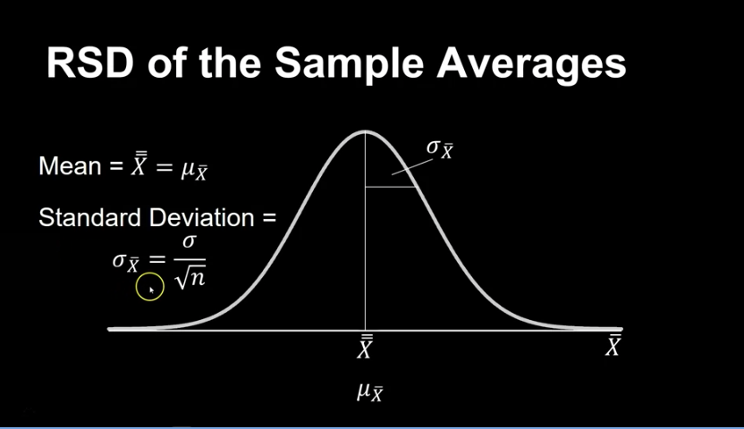
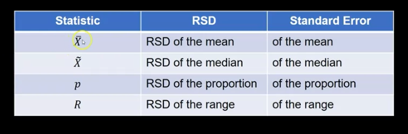
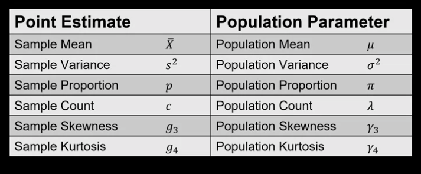
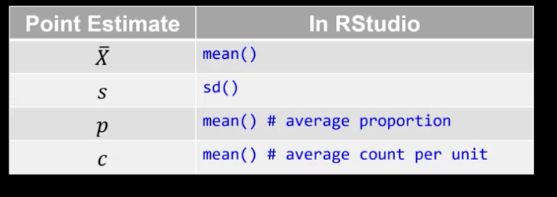
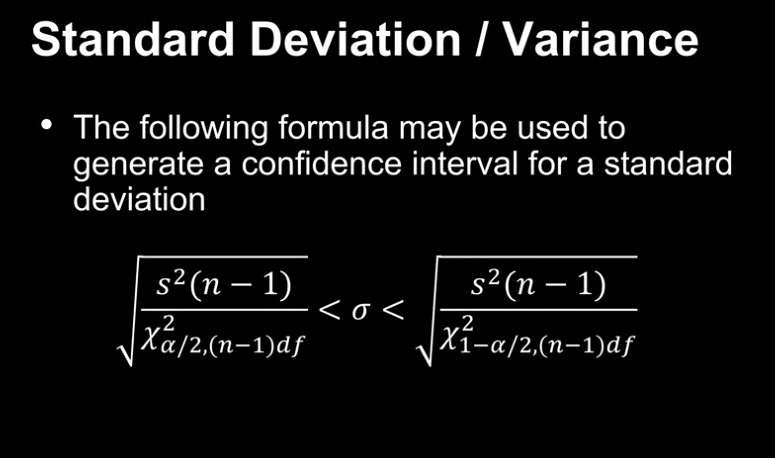

# Sampling Error


To create random number is R from a specific distribution we use `rnorm()`, `rexp()`, `rpois()`, `rbinom()`. 
```{r load_pkgs}
require(lolcat)
```
```{r distr_ex}
# Create four random samples of size n=30 with Mu = 100, sigma = 10
d1<-rnorm(n = 30,mean = 100, sd = 10)
d2<-rnorm(n = 30,mean = 100, sd = 10)
d3<-rnorm(n = 30,mean = 100, sd = 10)
d4<-rnorm(n = 30,mean = 100, sd = 10)

# Create a dataframe of all variables
normdata<-data.frame(d1,d2,d3,d4)

# Review summary statistics of all variables
summary.all.variables(normdata, stat.sd=T)

# Make output easier to read
nqtr<-function(x,d){noquote(t(round.object(x, d)))}
nqtr(summary.all.variables(normdata, stat.sd=T),3)
```

```{r hists}
# Create histograms of each variable in one plot
# Set parameters for graphical output, and create a matrix of nrows x ncols 
par(mfrow=c(2,2))
hist.grouped(normdata$d1)
hist.grouped(normdata$d2)
hist.grouped(normdata$d3)
hist.grouped(normdata$d4)
```

```{r hist2}
# Set parameters back to one graph
par(mfrow=c(1,1))
randoexp<-rexp(n = 100, rate = 1/10)
hist.grouped(randoexp)
```

#### Sampling Error
- An expected phenomenon since we are not measuring all of the subjects or units for the entire population

- Statistical Methods allow us to account for sampling error, and make appropriate decisions

- In spite of the presence of sampling error, random sampling allow us to use sample statistics as point estimators of population parameters; however, even when unbiased. It will not exactly equal the true value

- An observed difference between a true parameter value and its associated sample descriptive statistic is caused by **sampling error**

- The expected and quantifiable discrepancy between a population parameters and its associated descriptive statistic due to the sample size employed, and in the case of some descriptive statistics, the variability of the population.

-Sampling error is quantifiable using Random Sampling Distributions (RSDs)

- These distributions, like al probability distributions, are based on the principles of classical probability

# Random Sampling Distributions and CLT

## Random Sampling Distributions

- A RSD is the distribution of a sample statistic calculated from all possible random samples of the given (fixed) size from a given population
  - It is a population distribution and foundational for understanding statistical inference

- To create a RSD
  - Draw all possible random samples of size n from a given research population
  - Calculate descriptive statistics for each of the samples
  - Construct a distribution for each of the sampled descriptive statistics
  - Each of thje resultant distributions constitutes the RSD of the statistics



```{r rsd_in_R}
# Random Sampling Distribution Simulation
nqtr<-function(x,d){noquote(t(round.object(x, d)))}

# First, set seed so we will get the same results
set.seed(133)

# Create a distribution with mean of 10 and standard deviation of 2
pop<-rnorm(n = 50000, mean = 10, sd = 2)

# Create a histogram of the population distribution
hist.grouped(pop, anchor.value = 0)
hist.grouped(pop, anchor.value=0)

# Calculate the descriptive statistics of the population distribution
nqtr(summary.continuous(pop, stat.sd=T),5)

# Next, create / simulate a random sampling distribution
# Set the sample size equal to 4
n<-4

# Create the number of repetitions 
# (number of times we will take a sample of size 4)
reps<-5000

# Take the random samples from a population with a mean of 10 and 
# standard deviation of 2
samples <- replicate(reps, rnorm(n, mean = 10, sd = 2))

# Calculate the averages of each sample of 4
sampleavgs <- colMeans(samples)

# Calculate the descriptive statistics of the RSD
nqtr(summary.continuous(sampleavgs, stat.sd=T),5)

# Create 2 histograms of the population and sample averages 
# using the same axis to compare

# Create a 1 x 2 matrix
dev.off() # turns off the default
layout(matrix(1:2, nrow=2)) 

# Create both histograms
hist.grouped(pop, xlim=c(0,22), xaxt='n', width.consider = 1)
axis(side = 1, at = seq(0,22,2), labels = seq(0,22,2))

hist.grouped(sampleavgs, xlim=c(0,22), xaxt='n', width.consider = 1)
axis(side = 1, at = seq(0,22,2), labels = seq(0,22,2))

```

## Probability with RSDs

Can estimate probability with z-score
$$Z_{\bar{X}} = \frac{\bar{X} - \mu}{\frac{\sigma}{\sqrt{n}}}$$

```{r rsds}
# Using the RSD to solve probability problems
# Example 1
# Define the variables in the problem
mu1<-1.325
sigma1<-0.045
n1<-25
xbar1<-1.433
stderror1<-sigma1/sqrt(n1)

# Calculate the area under the normal curve using the pnorm function
pnorm(q = xbar1, mean = mu1,sd = stderror1, lower.tail = F)

# Create the normal curve
x=seq(1.28,1.45,length=200)
y=dnorm(x,mean=mu1,sd=stderror1)
plot(x,y,type="l")

# Indicate the location of the xbar of 1.433
abline(v=1.433)

# Example 2
# Define the variables in the problem
mu2<-50
sigma2<-14.4
n2<-25
xbar2<-55
stderror2<-sigma2/sqrt(n2)

# Calculate the area under the normal curve using the pnorm function
pnorm(q = xbar2, mean = mu2,sd = stderror2, lower.tail = F)

# Create the normal curve
x=seq(30,70,length=200)
y=dnorm(x,mean=mu2,sd=stderror2)
plot(x,y,type="l")

# Shade the upper tail area
x=seq(55,70,length=100)
y=dnorm(x,mean=mu2,sd=stderror2)
polygon(c(55,x,70),c(0,y,0),col="red")

# Indicate the location of the xbar of 55
abline(v=55)
```




# Estimates and Estimators

- **Point Estimate**
  - single number used to estimate an unknown parameter
  
- **Interval Estimate**
  - Range of values to estimate a parameter

- **Estimator**
  - A sample statistic used to estimate a population parameter. An estimate is a specific observed value of a statistic
  
- Criteria for "Good" Estimators
  - Unbiased
    - the mean of the RSD of the estimator is equal to the parameter it estimates
  - Efficiency
    - The standard error of the statistic RSD. The most efficient estimator is the one with the smallest standard err
  - Consistency
    - Refers to the assumption that as n increases, the value of the statistic approaches the value of its associated population parameter
    
  - Sufficient
    - Using all possible info the in the sample to estimate the corresponding parameter
    - example is using sd or var compared to the range since the range only uses two values




# Confidence Intervals

## Confidence Intervals

- The confidence level is the probability associated with an interval estimate
- This refers to the probability that the interval estimate includes the population parameter
- levels are 90, 95 and 99%

-The confidence interval is the range of the estimate. The range of values to find the true population parameter with a given level of confidence

- The interval estimate provides a way to qualify our estimate by indicating the magnitude of the sampling error and hence, the precision of our estimate

- To find this interval, we must look at the set of all possible parameters and assess each of those paramters for their probability of providing us with the sample statistic we observed

## Confidence Intervals for the Mean and Variance
```{r load_data_package}
require(lolcat)
Point_Estimates <- read.delim("~/Documents/GitHub/school_cu/school_cu/methods for quality improvement/DTSA5704_DescribingData/data/Point_Estimates.dat")

ro<-round.object
nqtr<-function(x,d){noquote(t(round.object(x, d)))}
options(scipen=999)
```
- Mean
  - When sd is known
  - When sd in unknown
- Standard Deviation / Variance

### Mean (Sigma Known)

$$\mu_{CI} = \bar{X} \pm z_{\alpha / 2} * \frac{\sigma}{\sqrt{n}}$$
```{r prob1}
# Confidence Interval for the Mean (Sigma is Known) -----------------------
# Example 1
n<-150
xbar<-20
sd<-5
conf<-0.95

#Use .simple syntax if not using dataframe. Otherwise, don't use the .simple
z.test.onesample.simple(sample.mean = 20
                        ,known.population.variance = 5^2
                        ,sample.size = 150
                        ,conf.level = 0.99)

# Round the output
ro(z.test.onesample.simple(sample.mean = 20
                        ,known.population.variance = 5^2
                        ,sample.size = 150
                        ,conf.level = 0.95),2)
```

### Means (Sigma Unknown)

- Use t distribution
  - lower at the mean and lower at the tails compared to the normal distribution
- t-distribution considers the fact there is error associated with the use of s, teh sample standard deviation to estimate the population (s)
- This error increases the variability of the resulting statistic, the t, relative to a standard normal distribution


$$\mu_{CI} = \bar{X} \pm t_{\alpha / 2, (n-1)df} * \frac{s}{\sqrt{n}}$$

```{r prob2}
# Confidence Interval for the Mean (Sigma is Unknown) ---------------------
# Example 2
n<-14
xbar<-15000
sd<-500
conf<-0.99

t.test.onesample.simple(sample.mean = xbar
                        ,sample.variance = sd^2
                        ,sample.size = n
                        ,conf.level = conf)
```
### Standard Deviation



```{r std_ci}
# Confidence Interval for the Variance ------------------------------------
# Example 3
sd<-10
n<-25
conf<-0.95

ci.var<-variance.test.onesample.simple(sample.variance = 10^2
                               ,sample.size = 25
                               ,conf.level = 0.95)

# Confidence Interval for the Variance
ci.var$conf.int

# Confidence Interval for the Standard Deviation
sqrt(ci.var$conf.int)
```
```{r tests_using_file}
# Generate Confidence Intervals using a file
# Using the point estimate file, calculate the 95% confidence interval 
# estimates for the mean, variance and standard deviation for the Weight data

# Test for normality
summary.continuous(Point_Estimates$Weight)

# Calculate confidence intervals
t.test.onesample(Point_Estimates$Weight, conf.level = 0.95)


```

## CI  for Porportions and Poisson Counts

ex)
- n = 100
- p = 0.12
- Confidence Level Desired = 95%

- mean = np = 12
- n = 100
- a = 0.05

- lower_ci = qbeta(0.025; 12,89) = 0.0636
- upper_ci = qbeta(0.975; 13, 88) = 0.2002

```{r binom}
# Confidence Interval for a Proportion -----------------------
# Example 1
ro(proportion.test.onesample.exact.simple(sample.proportion = 0.12
                                       ,sample.size = 100
                                       , conf.level = 0.95),4)

# Using the Point Estimate File, calculate the 90% confidence interval for the 
# Proportion

(prop<-mean(Point_Estimates$Proportion)) # average proportion
(n<-length(Point_Estimates$Proportion)) # sample size

# Proportion (Exact) 
ro(proportion.test.onesample.exact.simple(sample.proportion = 0.03525
                                       ,sample.size = 20
                                       ,conf.level = 0.90),4)
```

### Poission
- n = 20
- lambda = 25.05
- desired CI = 95%
- lambda * n = 501
- alpha = 0.05

- lambda_lower = qgamma(0.025; 501)/20 = 22.90
- lambda_upper = qgamma(0.975; 502)/20 = 27.34

```{r poiss_counts}
# Confidence Interval for Poisson Counts ---------------------
# Using the Point Estimate File, calculate the 99% confidence interval for the 
# Poisson Counts

# Make sure data are Poisson distributed
poisson.dist.test(Point_Estimates$Count)

# Get Total Counts in the Sample
(counts<-sum(Point_Estimates$Count))

# Get Sample Size
(n<-length(Point_Estimates$Count))

poisson.test.onesample.simple(sample.count = 501
                               ,sample.size = 20
                               ,conf.level = 0.90)
```
# Homework Quiz

*All wrong
```{r hmwrk1}
#mean = 5.0061
#
set.seed(145)
d1<-rnorm(n = 10000,mean = 5, sd = 1)
normdata = data.frame(d1)
summary.all.variables(normdata, stat.sd=T)
```

```{r hmwrk2_3}
#mean = 5.0061
#
set.seed(100)
vec = c()

for (x in 1:5000) {
  d1<-rexp(100, 1/5)
  mean_d1 = mean(d1)
  vec = c(vec, mean_d1)
}

round(skewness(vec), 4)
round(kurtosis(vec), 4)
```

```{r exp}
  d1<-rexp(100, 1/5)
d1
```
4) Approximately normal
5) CLT, Sample Size

```{r hmwrk6}
mu = 150
sd = 10
n = 15

stderror = sd / sqrt(n)
stderror
```

```{r hmwrk7}
mu = 1.575
sigma = 0.01
n=5

stderror = sigma / sqrt(n)

pnorm(q=1.58, mean=mu, sd=stderror, lower.tail=F)
```

```{r hmwrk8}
mu = 1.575
sigma = 0.01
n=10

stderror = sigma / sqrt(n)

pnorm(q=1.572, mean=mu, sd=stderror, lower.tail=T)
```

9) Point and interval estimates are values, estimates are mathematical functions. Interval Estimates will vary based on the desired Confidence Level

10) Mean and std

```{r load_hmwrk_data}
preforms <- read.csv("~/Documents/GitHub/school_cu/school_cu/methods for quality improvement/DTSA5704_DescribingData/data/preforms.dat", sep="")
```

```{r hmwrk11}
mean(preforms$weight)
```

```{r hmwrk12_13_14}
#95% CI

t.test.onesample(preforms$weight, conf.level = 0.95)
``` 

```{r hmwrk15_16}
#90% CI

t.test.onesample(preforms$weight, conf.level = 0.90)
``` 

17) As the confidence level of an estimator increases, the confidence interval becomes wider

```{r hmwrk18_19}
# Poisson counts
n = 500
p = 15/500
conf = 0.95

proportion.test.onesample.exact.simple(sample.proportion=p, sample.size = n, conf.level = 0.95)

```

```{r hmwrk20_21}
n_counts = 250
lambda = 2.58

sample_size = lambda * n

poisson.test.onesample.simple(sample.count = sample_size,sample.size = n_counts,conf.level = 0.90)
#lower= 2.4152
#higher = 2.7535
```