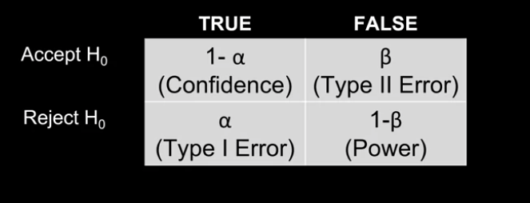
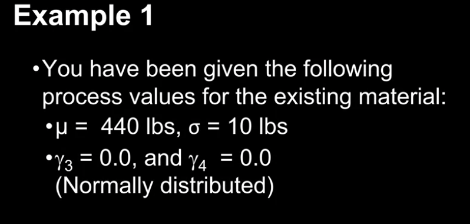
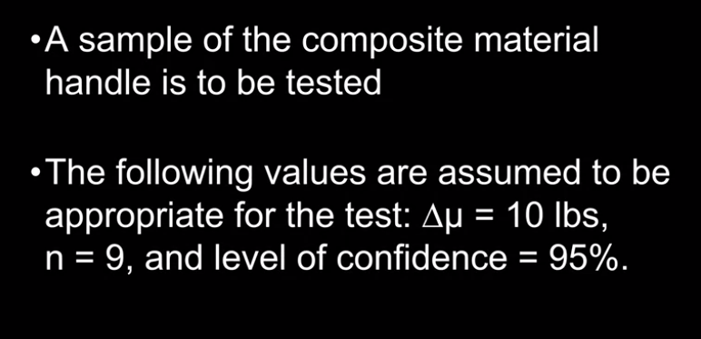
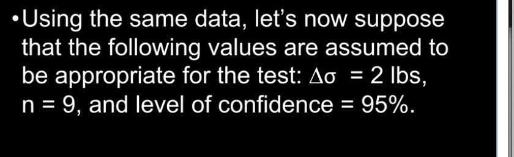
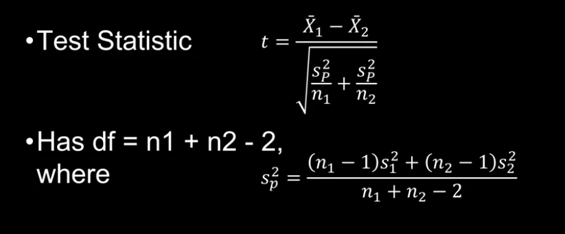

```{r setup, include=FALSE}
knitr::opts_chunk$set(echo = TRUE)
```

```{r packages}
require(lolcat)
```

# Hypothesis Testing

- What is a hypothesis?
  - An assumption related to a process or population

- Hypothesis Testing 
  - is a procedure which uses sample statistic(s) to make inference about a population

- Statistical Significance
  - Refers to the assumption that the observed difference or association/phenomenon represents a significant departure from what might be expected by chance alone
  
### Significance Level and Risk

- $\alpha$ is a selection of risk that you are willing to take

- Given a true null hypothesis, $\alpha$ is the probability the null hypothesis could be rejected (Type I Error)
  - The smaller the selected level of $\alpha$, the smaller the probability of rejecting a true null hypothesis
  - The researcher selects this value

- **p-value**
  - The probability that an observed statistic, or one that is more extreme, could have occurred by chance, given a true null hypothesis
  - reject a null hypothesis of the p-value is less than or equal to the selected level of $\alpha$
  
- Test Statistics
  - In hypothesis testing we
    - take samples
    - Calculate sample statistics
    - Calculate test statistics
    - Calculate Probabilities


### Type 1 and 2 Error

- Type I and II Error
  - When testing the hypotheses, we can make errors with respect to our conclusions
  - these errors are referred to as Type I and Type II errors
  
- Type I error
  - symbol: $\alpha$
  - The probability of rejecting a true null hypothesis
  - Also referred to as a false positive, or producer's risk

- Type II error
  - "The ability to detect something" 
  symbol: 1 - $\beta$
  - The probability of rejecting a false null hypothesis
  - The ability of the test to correctly reject a false null hypothesis

- Confidence
  - Symbol: 1 - $\alpha$
  - The probability of accepting a true null hypothesis

#### Expermental Outcomes

The top row represents the True outcome that should happen. The column represents what we do according to our test



### Observations
- $\alpha$ + $\beta$ will never equal 1. They are conditional probabilities based upon different conditions
- Specifically, $\alpha$ is based upon the premise that $H_{0}$ is true, $\beta$ is predicated on the assumption that $H_{0}$ is false

- Both $\alpha$ and $\beta$ represent risk
  - the expression of the researcher's willingness to commit an error in inference
  
- Power, the ability of the test to correctly 
reject a false $H_{0}$, must be "purchased" with sample size and with the selection of an appropriate experimental design

- $\alpha$ is not always more important than $\beta$

# Beta, Power and Sample Size

### Beta and Power
- Power is the prob of correctly reject a False $H_{0}$
  - Correct decision when $H_{0}$ is false
  - Power is designated as 1 - $\beta$
  - Used to determine how well a test is working and likely to detect a true effect (or difference)
  - Affected by
    - True value of population parameters
    - Significance level
    - Standard Deviation
    - Sample Size

- Strategies for Considering Power in Experiments
  - Strategy 1
    - Fix the probability of committing a Type I error
    - Then select a sample size large enough so that $\beta$  is acceptably small and testing is not too expensive or time consuming to conduct
  - Strategy 2
    - Consider the Null and Research Hypothesis and select the $\alpha$ and $\beta$ pair which best represent your wishes related to the research
    - Then, calculate the sample size required to maintain the selected risk levels
    
-Calculating $\beta$ and Power for means
  - Determine the critical value in the $H_{0}$ corresponding the the z-value for the given value of $\alpha$
  - Calculate the z-value and area corresponding to the calculated on the "H_{1} is true" (in other words the $\bar{X}$ value given in the alternative hypothesis) curve
  
    
### Other things to keep in mind
- The large the value od $\mu_{0} - \mu_{0}$, also known as delta, the larger power (1 - $\beta$) will become
- Generally, both $\alpha$ and $\beta$ should be small. In industry, studies planned without an initial regard for $\beta$ generally result in low power or high $\beta$ values

- It's not possible to commit a Type I and Type II error at the same time
- Had a two-tailed test been employed, the power of the test would have been the sum of the two areas falling beyond $\alpha$ on the $H_{1}$ distribution
- Increasing $\alpha$ will generally reduce $\beta$ 

- Increasing n will generally increase power

- Increasing power of the test can be accomplished by reducing the standard error through design modifications (for example, matched groups and stratified sampling)

### Calculating Power


##### Beta and Power for Changes in Means

```{r power_meanas}
# Example 1 - Calculating Power for Changes in Means
power.mean.t.onesample(sample.size = 9
                       ,effect.size = 10
                       ,variance.est = 10^2
                       ,alpha = 0.05
                       ,alternative = "two.sided")
```

#### Beta and Power for changes Variance


```{r power_variance}
# Power to detect an increase in variance
power.variance.onesample(sample.size = 9
                         ,null.hypothesis.variance = 10^2
                         ,alternative.hypothesis.variance = 12^2
                         ,alpha = 0.05
                         ,alternative = "two.sided")

# Power to detect a decrease in variance
power.variance.onesample(sample.size = 9
                         ,null.hypothesis.variance = 10^2
                         ,alternative.hypothesis.variance = 8^2
                         ,alpha = 0.05
                         ,alternative = "two.sided")
```

### Calculating Sample Size

- The proper sample size is not an opinion
- The minimum effect size ($\delta$) to be detected
- That is, the smallest degree of shift in the parameter that the researcher wishes to identify
- The number of treatment levels (groups)
- Population variance
- Probability of committing a Type I and Type II error

#### Sample size for two sample tests of Means
- Assumptions
  - $\sigma$ is unknown
  - Continuous data, independent samples
  - 2 normal distributions
  - Non-directional tests

- we have to solve iteratively to find the smallest value for a formula


##### Example
- $\alpha$ = 0.05
- $\beta$ = 0.02
- $\delta$ = 1
- $sigma$ = 2
- What is the appropriate sample size?


```{r sample_size_power1}
alpha<-0.05
beta<-0.02
deltamu<-1
sd<-2
sample.size.mean.t.onesample(effect.size = 1
                             , variance.est = 2^2
                             , alpha = 0.05
                             , beta = 0.02
                             , alternative = "two.sided")
```

#### Sample Size for test of Variance

- For non directional test, we must consider two cases
  - One in which the variance increases
  - One in which the variance decreases

```{r sample_size_variance}
# Sample Size Calculations for Changes in Variance ---------------------------
# Sample Size, one sample
sigma0<-2 # 4 variance
sigma1<-3 # 9 variance
sigma2<-1 # 1 variance
alpha<-0.05
beta<-0.02

# Two sided, one sample (testing for a change in either direction)
# In this situation, I use the two.sided test for both the larger and smaller variance,
# and take the larger sample size of the two.
sample.size.variance.onesample(null.hypothesis.variance = sigma0^2
                               ,alternative.hypothesis.variance = sigma1^2
                               ,alpha = alpha
                               ,beta = beta
                               ,alternative = "two.sided")

sample.size.variance.onesample(null.hypothesis.variance = sigma0^2
                               ,alternative.hypothesis.variance = sigma2^2
                               ,alpha = alpha
                               ,beta = beta
                               ,alternative = "two.sided")
```

# Testing for Differences / Changes in Means

## Independent vs Dependent Samples

- How to select the Appropriate Test for Two Samples
  - Identify the type of data associates with the Criterion Measure of interest
    - Nominal
    - Ordinal
    - Continuous
- Independent Samples
  - There are no linkage between any items in each of the two samples
  - Example
    - An admissions officer of a small college wants to compare the mean standardized test scores of applicants educated in rural high schools versus urban high schools.
- Dependent Samples
  - Each of the items within each sample are independent of every other item in the sample
  - Each item (specimen) in one group is linked or related to a corresponding item in the other sample
  - Can be due to 
    - repeated measures
      - two sets of data represent repeated measures (pairs of observations) from
      a single sample (dependent by nature)
    - Matching / Pairing
      - The two samples are dependent by design, based on paired or grouped
      testing through time, or upon a pretest or covariate
  - Example
    - an analyst for an educational testing service wants to compare the mean GMAT scores of students before and after taking a GMAT review course.


## Two Independent Sample Tests for Means
- Unknown variances (t test)
  - When they are both equal
  - When they are unequal
  
#### When we assume equal variance

- $H_{0} : \mu_{1} = \mu_{2}$
- $H_{0} : \mu_{1} \neq \mu_{2}$




```{r load_capPull2}
CapPull2 <- read.delim("~/Documents/GitHub/school_cu/school_cu/methods for quality improvement/DTSA5704_DescribingData/data/CapPull2.dat")
```

```{r unequal_var_code}
ro<-round.object
nqtr<-function(x,d){noquote(t(round.object(x, d)))}
options(scipen=999)

# Two Sample t Test, Equal Variance ---------------------------------------

# Use simple when all parameter estimates are given
ro(t.test.twosample.independent.simple(sample.mean.g1 = 0.0060
                                    ,sample.variance.g1 = 0.0015^2
                                    ,sample.size.g1 = 25
                                    ,sample.mean.g2 = 0.0090
                                    ,sample.variance.g2 = 0.0013^2
                                    ,sample.size.g2 = 30
                                    ,conf.level = 0.95),6)

# CapPull2.dat file

# Use when you have a data file available
t.test.twosample.independent(g1 = CapPull2$pull[CapPull2$mold==1]
                             ,g2 = CapPull2$pull[CapPull2$mold==2])

# Make factors
str(CapPull2)
CapPull2$mold<-as.factor(CapPull2$mold)
str(CapPull2)

# Descriptive Summary
summary.continuous(fx = pull~mold, data = CapPull2)

# Use when you want to use a formula of y~x and have 
# a data file with factors
t.test.twosample.independent.fx(fx = pull~mold
                                ,data = CapPull2)
# Data visualization
boxplot(pull~mold, data = CapPull2, col="red")

process.group.plot(fx = pull~mold,data = CapPull2)
```
## Two Sample of Unequal Variance t Test for Means

- The samples are randomly selected from two independent population or processed
- The underlying processes are normally distributed
-The population or process variances are not equal

```{r unequal_variance}
ro(t.test.twosample.independent.simple(sample.mean.g1 = 75
                                    ,sample.variance.g1 = 20^2
                                       ,sample.size.g1 = 12
                                       ,sample.mean.g2 = 82
                                       ,sample.variance.g2 = 9^2
                                       ,sample.size.g2 = 12
                                       ,conf.level = 0.90),4)
```

## Two Dependent Sample Tests for Means

### Repeated Measures t test for Means

- Used to compare means of repeated measures or paired groups
- Tests tests the following hypotheses

$H_{0} : \mu_{1} = \mu_{2}$
or
$H_{0} : \mu_{d} = 0$

$H_{0} : \mu_{1} \neq \mu_{2}$
or 
$H_{0} : \mu_{d} \neq 0$

### Assumptions

#### Repeated Measures
- the n pairs of scores are independent of one another
- The population for difference scores is normally distributed, as are the populations for each group

#### Matched Pairs
- The specimens in the two samples are independent (by nature)

- The population for difference scores is normally distributed, as are the populations for each group

- Homogenity of varaince is assumed (Not critical if sample sizes are equal)

- The units or specimens in the two samples are dependent by design

```{r load_data2}
Noise <- read.delim("~/Documents/GitHub/school_cu/school_cu/methods for quality improvement/DTSA5704_DescribingData/data/Noise.dat")
```

```{r dependent calculations}
# Paired t test for Means (Dependent by Nature) -------------------------------------------------
summary.continuous(Noise)[-1,]

# Calculate difference between Old and New
Noise$Diff<-Noise$Old-Noise$New

summary.continuous(Noise)[-1,]

# Drop first and fourth column
Noise<-Noise[-c(1,4)]

# Transpose data
Noise.I<-transform.dependent.format.to.independent.format(data = Noise)
Noise.I
str(Noise.I)
Noise.I$cell<-as.factor(Noise.I$cell)

# Paired t test
t.test.twosample.dependent(x1 = Noise$Old
                           ,x2 = Noise$New)

# Calculate difference between Old and New
Noise$Diff<-Noise$Old-Noise$New

# Dbar method
t.test.twosample.dependent.simple.dbar(pair.differences.mean = mean(Noise$Diff)
                                       ,pair.differences.variance = var(Noise$Diff)
                                       ,sample.size = 10)

# Calculate the Pearson Product Moment Correlation Coefficient
cor(Noise$Old, Noise$New)

cor.pearson.r.onesample(x = Noise$Old, y = Noise$New)


# Matched Pairs t test (Dependendent by Design) ---------------------------
cor.pearson.r.onesample.simple(sample.r = 0.60, sample.size = 30)

ro(t.test.twosample.dependent.simple.meandiff(sample.mean.g1 = 35.24
                                              ,sample.mean.g2 = 38.02
                                              ,sample.variance.g1 = 5.18^2
                                              ,sample.variance.g2 = 5.63^2
                                              ,sample.size = 30
                                              ,rho.estimate = 0.60),4)


```

# Testing for Differences / Changes in Variance

# Two Sample Tests for Variances

#### Assumptions: F Test for Variances
- The samples are randomly selected from two independent populations or processes
- The underlying processes are normally distributed
- The F Test for Variances is not performed when using a t test for means

```{r two_sample}
# Two Independent Sample F Test for Variances -----------------------------------------

ro(variance.test.twosample.independent.simple(sample.variance.g1 = 0.0015^2
                                              ,sample.size.g1 = 25
                                              ,sample.variance.g2 = 0.0013^2
                                              ,sample.size.g2 = 30),7)

# Compare results to t test
ro(t.test.twosample.independent.simple(sample.mean.g1 = 0.0060
                                       ,sample.variance.g1 = 0.0015^2
                                       ,sample.size.g1 = 25
                                       ,sample.mean.g2 = 0.0090
                                       ,sample.variance.g2 = 0.0013^2
                                       ,sample.size.g2 = 30
                                       ,conf.level = 0.95),7)


```

```{r iso_plot}
#ISO Plot to Compare Variances
# ISO Plot Example for Variances
g1<-rnorm(n = 100, mean = 10, sd = 2)
g2<-g1+rnorm(n = 100, mean = 0, sd = runif(1,0,2))
plot(g1, g2, xlab = "Group 1", ylab = "Group 2")
abline(lm(g2~g1))

# Add ISO line
min <- min(range(g1), range(g2))
max <- max(range(g1), range(g2))
lines(x = min:max, y = min:max, lwd = 2, lty = 2, col = "blue")


```
### The Dependent Sample T-test for Variances
#### Assumptions
- The pairs of scores are independent of another
- The sample data are either dependent by nature, or dependent by design (cirtical, therefore you may be required to test correlation)
- The underlying process distributions are normally distributed (not critical if n is large)

```{r dependent_t_variance}
# Matched Pairs t test for Variances --------------------------------------
cor.pearson.r.onesample.simple(sample.r = 0.60, sample.size = 30)

variance.test.twosample.dependent.simple(sample.variance.g1 = 5.18^2
                                         ,sample.variance.g2 = 5.63^2
                                         ,sample.size = 30
                                         ,rho.estimate = 0.60
                                         ,conf.level = 0.95)
```

# Testing for differences / changes in Proportions

### Fisher's Exact Test

#### Assumptions
- The two processes from which the sample data are drawn are inherently independent in nature, and are both based upon the Bernoullis process
- The samples are randomly selected from the underlying processes being investigated

```{r Fishers_test}
# Two Sample Tests for Proportions ----------------------------------------

# Fisher's Exact Test
proportion.test.twosample.exact.simple(sample.proportion.g1 = 0.18
                                       ,sample.size.g1 = 750
                                       ,sample.proportion.g2 = 0.12
                                       ,sample.size.g2 = 750
                                       ,conf.level = 0.99)
```


### McNemar's Test for Change

```{r mcnemar}
# McNemar's Test for Change - Dependent Proportions -----------------------
# Contingency table format = ct<-(a,c,b,d)
ct<-c(56,56,4,4)

# Create Contingency Table
(ct.new<-matrix(ct,nrow = 2
                , dimnames = list("Before Maint" = c("Pass", "Fail"),
                                  "After Maint" = c("Pass", "Fail"))))

# Perform McNemar's Test
(mcnemar.out<-proportion.test.mcnemar.simple(b = 4, c = 56))

mcnemar.test(ct.new)
```

## Two Sample Independent Tests for Poisson Counts

```{r load_file_pois}
Eddycur <- read.delim("~/Documents/GitHub/school_cu/school_cu/methods for quality improvement/DTSA5704_DescribingData/data/Eddycur.dat")
```

```{r pois}
# Two Sample Independent Tests for Poisson Rates (Counts) -----------------

# Descriptive Summary
summary.impl(Eddycur$Before, stat.n = T, stat.mean = T)
summary.impl(Eddycur$After, stat.n = T, stat.mean = T)

# Test for Poisson distribution
poisson.dist.test(Eddycur$Before)
poisson.dist.test(Eddycur$After)

# Poisson test
# Remember that sample count has to be 
# n times lambda
(count_before<-sum(Eddycur$Before))
(n_before<-length(Eddycur$Before))

(count_after<-sum(Eddycur$After))
(n_after<-length(Eddycur$After))

poisson.test.twosample.simple(sample.count.g1 = 112
                              ,sample.size.g1 = 130
                              ,sample.count.g2 = 260
                              ,sample.size.g2 = 130)
```