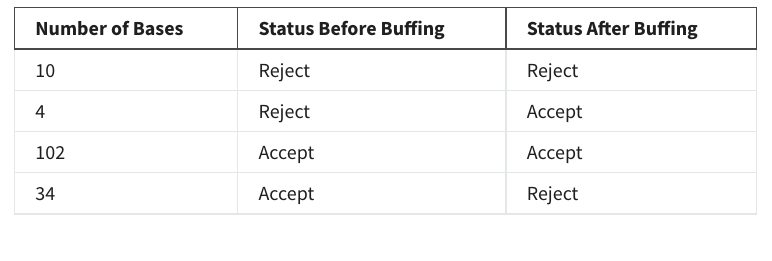

```{r lolcat}
require(lolcat)
require(dplyr)
```

# Question 1: Which hypothesis is generally related to the research question?
-should be alternative

# Question 2: Test statistics are:
- standardized statistics that have defined probabilities distributions

# Question 3: True or False: A researcher is more likely to make a Type I error with a directional (one-tailed) test than with a non-directional (two-tailed) test.
- True

# Question 4: True or False: Power is the ability to detect a true difference when it exists.
- true

# Question 5: A new drug therapy is being tested for efficacy as compared to a placebo.The results of the study say that a statistically significant difference exists, but in reality, there is no difference from the placebo. This is an example of  ______________.
- A Type I Error

# Question 6: When H0 is False and we Accept H0 which of the following describe what has occurred? (choose all that are correct):
- Type II Error
- Probability = $\beta$

#Q7:If management has initially identified the requirements of a hardness test to be ⍺ = 0.01, Δ𝛍 = 1, n = 20 and 𝛔 was estimated to be 2.0, what would the power be for to detect a change in the Mean? Record your answer to 4 places after the decimal point (e.g. X.XXXX).

```{r q7}
power.mean.t.onesample(sample.size = 20
                       ,effect.size = 1
                       ,variance.est = 2^2
                       ,alpha = 0.01
                       ,alternative ="two.sided")
#0.2973
```

#Q8: If management has initially identified the requirements of a hardness test to be ⍺ = 0.01, β = 0.05, Δ𝛍 = 1, and 𝛔 was estimated to be 2.0, what would be the minimum sample size needed to to detect a change in the Mean? Record your answer as an integer (e.g. XX).

```{r q8}
sample.size.mean.t.onesample(beta = 0.05
                       ,effect.size = 1
                       ,variance.est = 2^2
                       ,alpha = 0.01
                       ,alternative ="two.sided")

#75
```

#Q9: In a two-tailed situation, there are two different effects and sample sizes that need to be computed when doing the computations based on variances.
- True

#Q10: When a linking procedure (matching, blocking, pairing)  is used to create dependent samples, those samples will be:
- Dependent by design (but still independent by nature)

#A company is investigating two types of hearing protection devices to decrease the effective noise level experienced by its employees, either earmuffs or foam earplugs. The earmuffs are considerably more expensive, and the president wants to know at the 0.05 level of significance whether this expenditure has resulted in a change in the mean level of effective noise level. The sample results are shown below

- Earmuffs
  - mean = 72
  - n = 12
  - sd = 15
-Foam Earplugs
  - mean = 64
  - n = 15
  - sd = 19

#Q11: What is the value of the test statistic? Record your answer to 4 places 
# after the decimal point (e.g. X.XXXX)
Also, Q12, 13

```{r q11} 
#0.2451
t.test.twosample.independent.simple(sample.mean.g1 = 72,
                                    sample.variance.g1 = 15 * 15, 
                                    sample.size.g1 = 12, 
                                    sample.mean.g2 = 64, 
                                    sample.variance.g2 = 19 * 19, 
                                    sample.size.g2 = 15, 
                                    conf.level = 0.95)
```

```{r load_for_14_15_16}
ToolLife <- read.delim("~/Documents/GitHub/school_cu/school_cu/methods for quality improvement/DTSA5704_DescribingData/data/ToolLife.dat")
```

```{r code_for_14_15_16}
ToolLife %>% group_by(vendor) %>% summarise(
  mean1 = mean(life),
  variance = var(life)
)
```

#Q14,15,16: Question 14
One of the many consumable supplies that a company’s Purchasing Department is responsible for obtaining is cutter inserts for their lathe operations. The purchasing manager previously elected to buy an equal volume of cutters from two suppliers. The lathe operators, through time, had been reporting to their department supervisor that there was a difference between the two vendors’ cutter inserts in terms of cutting life. The supervisor decided to statistically test whether there was really a difference in the average cutting life between the two vendors’ inserts. She requested that her operators use the inserts fromthe two suppliers in a random fashion across the parts being machined and to record the total cutting time (life) for each of the inserts.

When sufficient data were compiled, the supervisor organized the obtained values as shown below, and saved them in a file named TOOLLIFE.DAT. The insert life was recorded in minutes. Assist the supervisor in conducting the appropriate analysis required to answer the research question


-Which Vendor has the higher mean?
 - Vendor 1
- Which Vendor has the higher variance?
  - Vendor 2
- Means

#Q17, 18, 19

Question 18
A steel bar straightening machine has been in use for 15 years. When the machine was purchased (prior to the implementation of quality improvement policies), it was assumed that it would perform as advertised. That is, it would significantly improve the straightness of the product. The process engineer had just recently attended a stats course in R. They became anxious to statistically test whether the straightening operation was changing the process mean for bar straightness. 

20 bars were randomly selected from a production lot and identified in a serial fashion. It was then arranged to have an inspector measure the straightness of each bar. Subsequently, the bars were put through the straightening operation. Each of the bars was remeasured for straightness after the operation by the same inspector. 

Because the measurements were repeated on the same parts and the data were paired according to the bar identification, we have data that are dependent by nature. The first column contains the straightness values measured prior to the operation and the second column contains the values measured after the operation. The values in each row represent the same specimen, in this case, a bar.  A flat bar has a value of zero, a non-flat bar has values above zero.  The data file is named Straight.dat.

Has the straightening operation significantly changed the process mean? Has the straightness of the population of bars been improved? Assume an ⍺ of 0.010.

```{r load17}
Straight <- read.delim("~/Documents/GitHub/school_cu/school_cu/methods for quality improvement/DTSA5704_DescribingData/data/Straight.dat")
```

- What is the source of the dependency?
  -Repeated Measures
```{r code18}
Straight$Diff = Straight$before - Straight$after
t.test.twosample.dependent(x1 = Straight$before,x2 = Straight$after)
```
#Q20_21_22

A plant superintendent has been assigned the task of improving the joint strength of a clutch assembly. The assembly consists of two components: the clutch cup and the drive sprocket. The two components are joined together by means of a brazing operation.

The plant superintendent wanted to investigate whether changing the brazing material would affect average braze strength. They decided he would braze one group with pure copper wire and braze another group with the existing copper alloy. One of the two components, the sprocket, is manufactured from powdered metal.

The superintendent had observed from past studies that there was a strong relationship between the density of the sprocket and the joint strength of the assembly after brazing. The greater the porosity of the powdered metal sprocket, the more absorption of the braze material takes place, resulting in a weaker bond.

They decided to use the known relationship between sprocket porosity and joint strength for setting up a matched-pairs design. 100 sprockets were randomly selected from inventory and identified and measured for density. They were then rank ordered from lowest to highest and paired according to their density. Each pair of sprockets was randomly assigned to one of two groups that were to receive the different brazing material. 

Once the random assignments were completed, the superintendent verified that there was no statistically significant difference between the two groups for density in terms of central tendency and dispersion.

The two groups were then run in pairs through the braze furnace. The braze strength of the assemblies was tested to failure in the laboratory on an Instron machine. The superintendent calculated the following statistics:

- Copper Alloy
  - Mean1 = 3671
  - s1 = 246
- Pure Copper
  - 4228
  - 182
- n1=n2=50 (pairs)
- r12=0.78
  
- What is the source of dependency
  - matching
  
- What is th test statistic and decision?
```{r q22}
t.test.twosample.dependent.simple.meandiff(sample.mean.g1 = 3671
                                              ,sample.mean.g2 = 4228
                                              ,sample.variance.g1 = 246 * 246
                                              ,sample.variance.g2 = 182 * 182
                                              ,sample.size = 50
                                              ,rho.estimate = 0.78)
```
#Q23_24_25 
- Earmuffs
  - mean = 72
  - n = 12
  - sd = 15
-Foam Earplugs
  - mean = 64
  - n = 15
  - sd = 19

Is the variability different? 
```{r q23}
variance.test.twosample.independent.simple(sample.variance.g1 = 15*15
                                              ,sample.size.g1 = 12
                                              ,sample.variance.g2 = 19*19
                                              ,sample.size.g2 = 15)
```
```{r load_data_26}
 Temper <- read.delim("~/Documents/GitHub/school_cu/school_cu/methods for quality improvement/DTSA5704_DescribingData/data/Temper.dat")
```

A process engineer arranged to measure the out-of-flatness characteristic after the heat and quench operation on 20 randomly selected units. The components were then stress relieved with a typical production lot. The same 20 units were re-measured for out of flatness after tempering. 

The recorded data are stored in a data file called Temper.dat. Zero indicates no warp.  A value greater than zero indicates the presence of warp. Use the appropriate hypothesis test to determine whether the fixture and the stress relief operation have effectively reduced out-of-flatness (on the average and variance). Be sure you make an iso-plot as part of your analysis. Assume a significance level of 0.05.

- The appropriate normality test to run prior to testing the data is:
  - Shapiro Wilk
  
```{r 27}
#only doing mean
Temper$Diff = Temper$before - Temper$after

# t.test.twosample.dependent.simple.dbar(pair.differences.variance = var(Temper$Diff)
                                       # ,sample.size = 10)

t.test.twosample.dependent(Temper$before, Temper$after)
```

```{r 29}
#False: the line of best fit and ISO are not parallel
#The line of best fit and the ISO line are parallel
#ISO Plot to Compare Variances
# ISO Plot Example for Variances
g1<-Temper$before
g2<-Temper$after
plot(g1, g2, xlab = "Group 1", ylab = "Group 2")
abline(lm(g2~g1))

# Add ISO line
min <- min(range(g1), range(g2))
max <- max(range(g1), range(g2))
lines(x = min:max, y = min:max, lwd = 2, lty = 2, col = "blue")
```

#30
- yes, an improvement has been made
# Q31,32, 33

In order to meet volume requirements, two injection molding machines are used to produce the same connector housing. There are several visual characteristics that are identified as critical to the customer. 

The plant manager has requested that the department supervisor determine if the nonconforming rate of all combined visual characteristics is different for the two machines. Note that a product is nonconforming if one or more nonconformities are found on the product.

Two random samples of 500 units each were selected from the production output from each machine. The parts were visually inspected and yielded the following results.

p1  = 0.054		p2 = 0.036

n1 =  500		n2 = 500

```{r 32}
proportion.test.twosample.exact.simple(sample.proportion.g1 = 0.054
                                       ,sample.size.g1 = 500
                                       ,sample.proportion.g2 = 0.036
                                       ,sample.size.g2 = 500
                                       ,conf.level = 0.95)
```

- What type of data?
  - Nominal

- What is the pvalue (with alpha being 0.05)?

# 34
The source of dependency is repeated measures.

# 35, 36, 37

The characteristic “shiny finish” on coated plastic cosmetic containers has been established as a critical characteristic for customers. One manufacturer of these products has incorporated an extra operation known as “buffing where applicable” to insure itself of meeting this customer expectation. Some of the components have a metallic chrome finish. The company has assumed that the buffing operation, which follows the chroming operation, naturally improves the shiny appearance of the surface.

One employee wanted to statistically test this assumption and was given permission by management to do so. They randomly selected 150 cosmetic bases from production after the chroming operation and performed the visual inspection procedures for judging acceptable and unacceptable shininess. They carefully numbered each of the parts before visually inspecting them in random order. They then arranged to have the parts buffed with regular production units. The parts were retrieved and they visually inspected them in the appropriate manner a second time. They then arranged the results in matched fashion as shown in the table below. Use the appropriate test and procedures to help them report the appropriate findings to management. Assume α = 0.05.


```{r 35}
#Dependency McNemar
ct = c(102,4,34,10)
(ct.new<-matrix(ct,nrow = 2
                , dimnames = list("Before Buffing" = c("Accept", "Reject"),
                                  "After MBuffing" = c("Accept", "Reject"))))
mcnemar.test(ct.new)
```

# 37, 38
# for 38 try no way to tell
Question 37
Safety data have been collected in a manufacturing plant for the past several years. During an initial time period of 2 years, 15 lost-time accidents occurred. A safety improvement program was then instituted.

During the next 1 year, 10 lost-time accidents occurred. Has the safety initiative resulted in an improvement in the safety level in the plant as measured by the lost-time accident rate?.

You may assume the data were tested and conform to a Poisson distribution. Use a Confidence Level of 95%.

```{r poisson}
#wrong pvalue
#since not rejecting null hypothesis, no way to tell if it made a difference
poisson.test.twosample.simple(sample.count.g1 = 30 #we need to use total count so thie case it's 15*30
                              ,sample.size.g1 = 2
                              ,sample.count.g2 = 10
                              ,sample.size.g2 = 1)
```